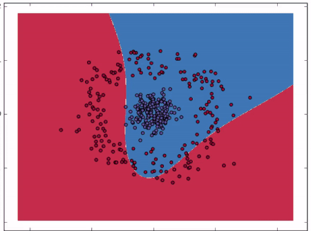

Neural Network from scratch
===================

#### [IPython notebook](mlnn.ipynb) illustrates experiments with a 4 layer network. 
Notebook setup-
```
# Create and activate new virtual environment (optional)
virtualenv venv
source venv/bin/activate
# Run notebook
jupyter notebook mlnn.ipynb
```  
&nbsp;
Please refer [mlnn.py](mlnn.py) for model code. 
> ### **Methods**
>* **fprop**(train_data_X) : Forward propagation using train_data_X.

>* **bprop**(train_data_X, train_data_y, regularization_lambda, epsilon) : Backward propagation using (train_data_X, train_data_y).

> * **predict**(train_data_X) : Make predictions using train_data_X.

> * **train**(train_data_X, train_data_y, regularization_lambda, epsilon, num_pass, print_loss) : Train network using  (train_data_X, train_data_y).

> * **visualize_preds**(train_data_X, train_data_y) : Plot classification graph.

> * **animate_preds**(train_data_X, train_data_y, regularization_lambda, epsilon, num_pass=35000) : Animate training process.  
 
 &nbsp;


#### Requirements:
* numpy
* sklearn
* matplolib 


*Please feel free to contact me at ishank269[at]gmail[dot]com to report any issues or you can open an issue [here](https://github.com/ishank26/nn_from_scratch/issues). Fork or clone for your use :)*
